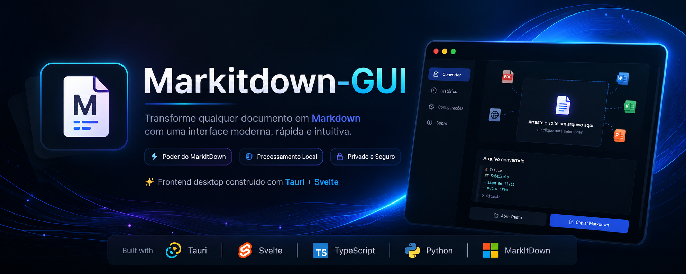

# Markitdown-GUI
<br>

<div align="center">



</div>

<br>

### Transforme qualquer documento em Markdown com uma interface moderna e intuitiva.

Frontend desktop construído com **Tauri + Svelte** para o **MarkItDown** da Microsoft.
<br>


---
<br>

<div align="center">

[Features](#-features) •
[Preview](#-preview) •
[Instalação](#-instalação) •
[Desenvolvimento](#️-desenvolvimento) •
[Tecnologias](#-tecnologias) •
[Roadmap](#-roadmap) 

<br>

---

</div>

<br>


## ✨ Features

* 📄 Conversão de documentos para Markdown
* 🖼️ Suporte a imagens
* 📊 Conversão de planilhas
* 📚 PDFs complexos
* 🌐 Páginas HTML
* ⚡ Interface extremamente rápida via Tauri
* 🎨 Tema escuro moderno
* 🖥️ Windows, Linux e macOS
* 🔄 Processamento local
* 🔒 Nenhum dado enviado para servidores

---

## 📸 Preview

---

## 🚀 Como funciona

```text
Documento
     │
     ▼
Microsoft MarkItDown
     │
     ▼
Backend Python
     │
     ▼
Tauri Bridge
     │
     ▼
Interface Svelte
     │
     ▼
Markdown Pronto
```

---

## 📦 Instalação

### Windows

Baixe a versão mais recente na seção Releases.

```powershell
MarkitdownGUI-Setup.exe
```

---

### Linux

```bash
chmod +x MarkitdownGUI.AppImage
./MarkitdownGUI.AppImage
```

---

### macOS

```bash
open MarkitdownGUI.dmg
```

---

## 🛠️ Desenvolvimento

### Requisitos

* Node.js 22+
* Python 3.11+
* Rust
* Tauri CLI

### Clonar

```bash
git clone https://github.com/billsarigue/Markitdown-GUI.git
cd Markitdown-GUI
```

### Instalar dependências

```bash
npm install
```

### Executar

```bash
npm run tauri dev
```

---

## 📚 Tecnologias

| Tecnologia | Função            |
| ---------- | ----------------- |
| Tauri      | Aplicação Desktop |
| Svelte     | Interface         |
| TypeScript | Frontend          |
| Python     | Backend           |
| MarkItDown | Conversão         |
| Rust       | Runtime Tauri     |

---

## 🎯 Roadmap

* [x] Integração com MarkItDown
* [x] Conversão básica
* [ ] Drag & Drop
* [ ] Conversão em lote
* [ ] OCR
* [ ] Exportação automática

---

## 🔒 Privacidade

Todo o processamento é realizado localmente.

Nenhum documento é enviado para servidores externos.

---


## 📜 Licença

Distribuído sob a licença MIT.

---

Made with Tauri, Svelte and Microsoft MarkItDown
